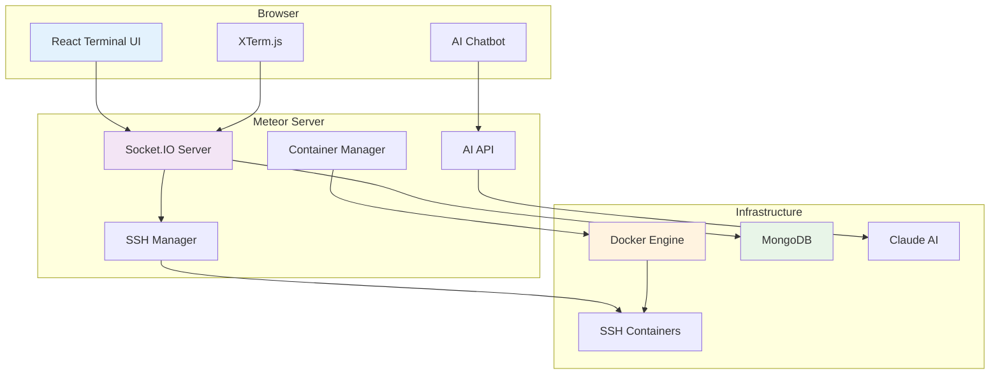

# SSH Terminal - Web-Based Container Terminal

A modern web-based SSH terminal application built with Meteor.js that provides secure access to containerized environments through your browser.

## Architecture Overview

https://www.mermaidchart.com/app/projects/765704fc-7c77-4eb4-b975-c9e4d9f9703b/diagrams/5ffef486-95d9-45cb-a3d5-5b150a59cb13/version/v0.1/edit



## Features

-  **Web-based SSH Terminal** - Access SSH sessions directly from your browser
-  **Container Management** - Create and manage Docker containers on-demand
-  **Multi-tab Interface** - Open multiple terminal sessions simultaneously
-  **AI Assistant** - Integrated Claude AI for SSH and Linux command help
-  **Session Persistence** - Resume sessions after disconnection
-  **Resource Monitoring** - Track system and container usage
-  **Audit Logging** - Complete session and activity logging

## Quick Start

1. **Prerequisites**
   ```bash
   # Install Node.js, Meteor, and Docker
   npm install -g meteor
   ```

2. **Installation**
   ```bash
   git clone <repository-url>
   cd meteor-ssh-terminal
   meteor npm install
   ```

3. **Setup Environment**
   ```bash
   echo "ANTHROPIC_API_KEY=your_api_key" > .env
   ```

4. **Build SSH Container**
   ```bash
   cd docker
   docker build -t ssh-terminal .
   ```

5. **Run Application**
   ```bash
   meteor run
   ```

6. **Access Application**
   - Open http://localhost:3000
   - Click "Create" to start a new container
   - Connect with: `root` / `password123`

## Technology Stack

- **Frontend**: React, XTerm.js, Socket.IO
- **Backend**: Meteor.js, Node.js
- **Containers**: Docker, SSH2
- **Database**: MongoDB
- **AI**: Anthropic Claude API

## Usage

1. **Create Container** - Use the "Create" button to spin up a new SSH container
2. **Connect** - Fill in connection details (auto-populated for new containers)
3. **Terminal Access** - Use the terminal just like a native SSH session
4. **AI Help** - Click the chat button for command assistance
5. **Multi-sessions** - Open multiple tabs for concurrent sessions


## Configuration

Key environment variables:
```bash
ANTHROPIC_API_KEY=your_anthropic_api_key  # Required for AI features
DOCKER_HOST=localhost                     # Docker daemon host
MONGO_URL=mongodb://localhost:27017/app   # Database connection
```

